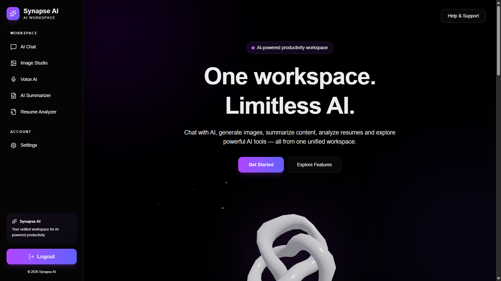
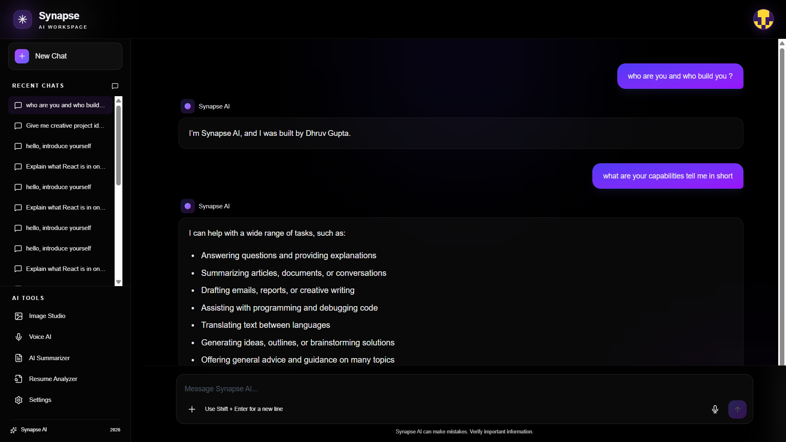
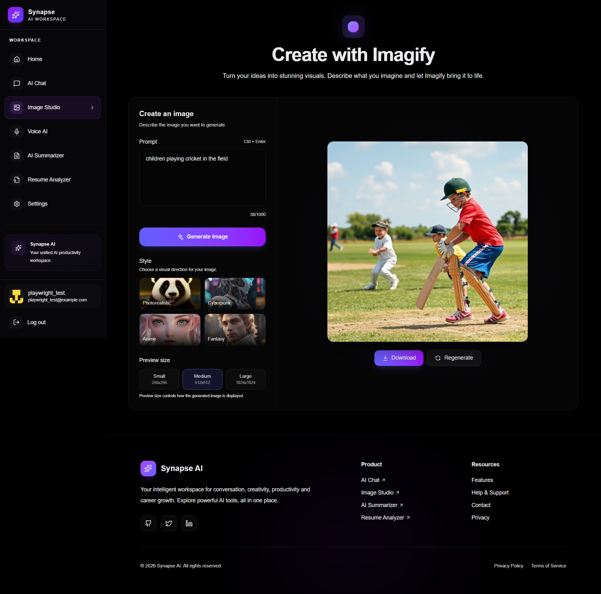
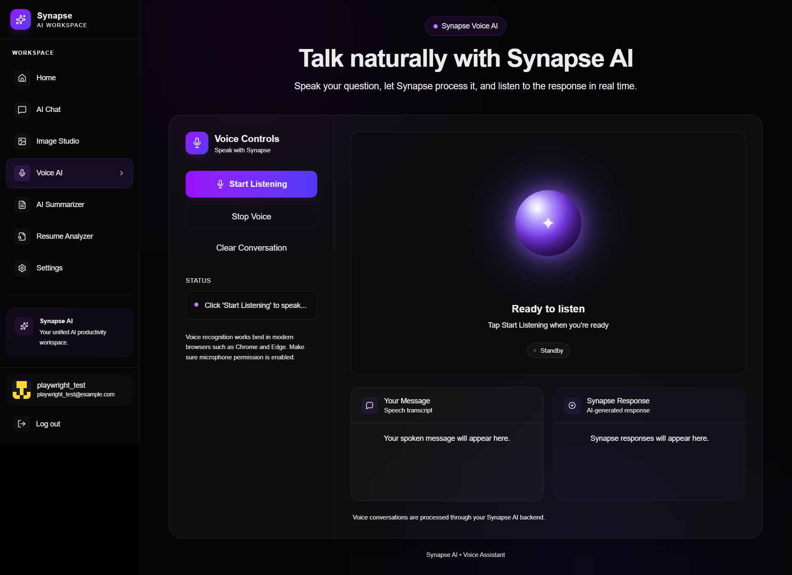
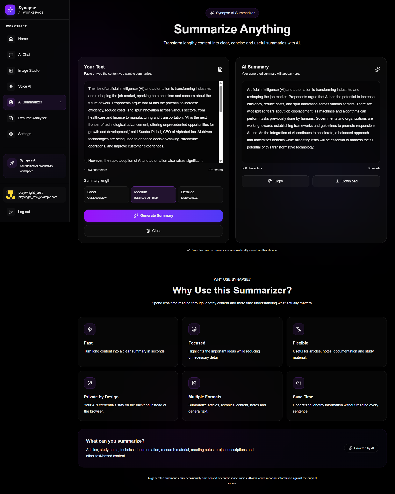
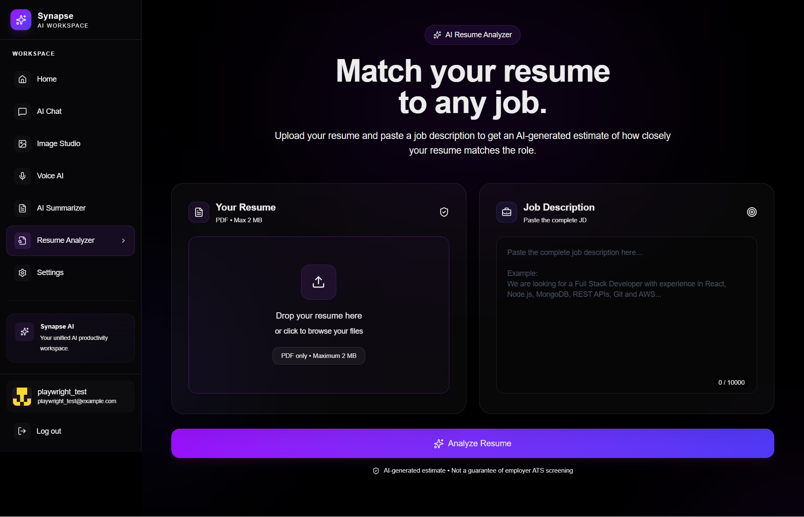
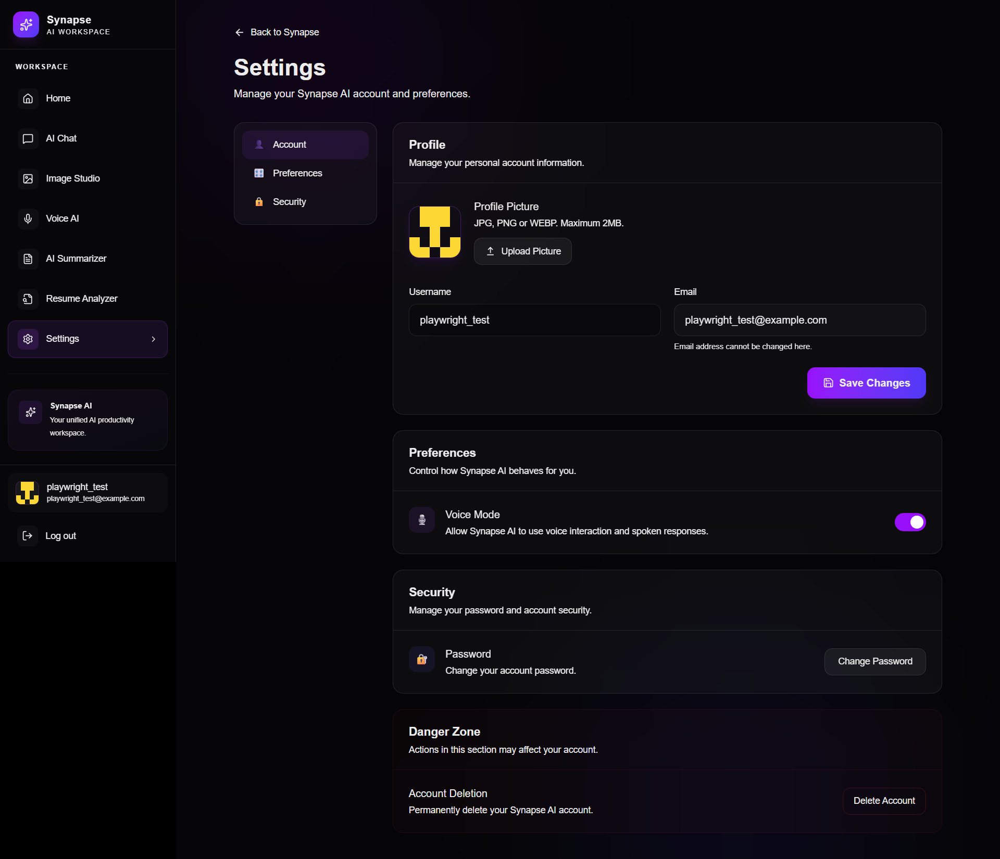

<div align="center">

# 🧠 Synapse AI

**One platform. Five AI-powered tools. Zero context switching.**

A full-stack AI workspace unifying conversational chat, voice interaction, image generation, text summarization, and resume ATS analysis — built on React, Node.js, Express, and MongoDB.

[](#tech-stack)
[](#tech-stack)
[](#tech-stack)
[](#-testing)
[](#-project-status)

[Features](#-features) • [Screenshots](#️-screenshots) • [Tech Stack](#️-tech-stack) • [Architecture](#️-application-architecture) • [Setup](#️-local-setup) • [Security](#-security-practices)

</div>

---

## 🚀 Overview

**Synapse AI** consolidates five distinct AI utilities — chat, voice, image generation, summarization, and resume analysis — into a single, cohesive, authenticated platform. Instead of juggling separate tools and APIs, users get one interface, one login, and one consistent experience.

Built with a modern **React + Node.js + Express + MongoDB** stack, Synapse AI integrates best-in-class AI providers (Groq, Hugging Face, ClipDrop) behind a clean, service-oriented backend — keeping each feature fast, modular, and independently maintainable.

**Highlights:**
- 🧩 Five AI-powered tools in one authenticated platform
- ⚡ Real-time AI chat with persistent, user-scoped history
- 🔐 Production-grade auth — JWT, Google Sign-In, password recovery
- 🖼️ Polished UI with animations, 3D visuals, and toast notifications
- ✅ End-to-end tested with Playwright across Chromium and Firefox

---

## ✨ Features

### 💬 AI Chat
A real-time conversational interface with persistent, per-user chat threads.
- Persistent chat threads & recent history
- New chat creation and conversation deletion
- Markdown-rendered AI responses
- User-scoped, protected chat access

**AI Provider:** Groq

### 🎙️ Voice AI
Hands-free interaction — speak to Synapse AI and hear it respond.
- Voice input with AI-generated responses
- Text-to-speech output
- Fully conversational voice experience

**AI Provider:** Groq

### 🎨 Imagify — AI Image Generation
Turn natural-language prompts into images in a dedicated creative workspace.
- Prompt-based image generation
- Dedicated generation interface with image display

**AI/Image Provider:** ClipDrop

### 📝 AI Text Summarizer
Summarize text through an AI-powered summarization pipeline.
- Short, medium, and detailed summary modes
- Text preprocessing and chunking for larger inputs
- AI-generated summaries

**AI Provider:** Hugging Face

### 📄 Resume ATS Analyzer
Benchmark a resume against a job description the way an ATS would.
- PDF resume upload and job description input
- ATS-oriented compatibility analysis
- Matching skills and missing keywords
- Actionable resume improvement suggestions

**AI Provider:** Groq

### 🔐 Authentication
A complete, production-ready auth system.
- Registration and username/password login
- JWT-based authentication
- Google Sign-In
- Forgot password / reset password flow
- Protected application routes

**Stack:** JWT + Google Identity Services

### 👤 Settings & Profile
- Update username and account details
- Upload profile/avatar image (Cloudinary)
- Change password securely

### 💾 Persistent Chat History
Conversations are stored in MongoDB and linked to authenticated users — create, continue, view, and delete chat threads at any time.

---

## 🖥️ Screenshots

<div align="center">

| Home | AI Chat | Imagify |
|---|---|---|
|  |  |  |

| Voice AI | Text Summarizer | Resume ATS Analyzer |
|---|---|---|
|  |  |  |

**Settings**



</div>

---

## 🛠️ Tech Stack

### Frontend
| Technology | Purpose |
|---|---|
| React.js | User interface |
| Vite | Development and build tool |
| React Router | Application routing |
| Tailwind CSS | Styling |
| Framer Motion | Animations |
| Lucide React | Icons |
| React Markdown | Markdown rendering |
| Three.js / React Three Fiber | 3D landing-page visuals |
| React Hot Toast | Notifications |
| Playwright | End-to-end testing |

### Backend
| Technology | Purpose |
|---|---|
| Node.js | Backend runtime |
| Express.js | REST API |
| MongoDB | Database |
| Mongoose | MongoDB object modeling |
| JWT | Authentication |
| Multer | File uploads |
| Nodemailer | Password-reset emails |

### 🤖 AI & External Services
| Service | Functionality |
|---|---|
| **Groq** | AI Chat, Voice AI, Resume ATS Analysis |
| **Hugging Face** | AI Text Summarization |
| **ClipDrop** | AI Image Generation |
| **Google Identity Services** | Google Sign-In |
| **Cloudinary** | Profile / Avatar Image Storage |
| **MongoDB** | Users, Chat Threads, and Messages |
| **Gmail / SMTP** | Password Reset Emails |

---

## 🏗️ Application Architecture

```text
                              SYNAPSE AI
                                  │
                ┌─────────────────┴──────────────────┐
                │                                     │
            FRONTEND                              BACKEND
         (React + Vite)                     (Node.js + Express)
                │                                     │
    ┌───────────┼────────────┐            ┌───────────┼────────────┐
    │           │            │            │           │            │
   Auth        Chat       AI Tools     Routes    Controllers    Services
                              │
                ┌─────────────┼──────────────┐
                │             │              │
            Imagify      Summarizer      Resume ATS
                │             │              │
            ClipDrop    Hugging Face        Groq
                                              │
                                    Chat + Voice + ATS
                                              │
                                          MongoDB
```

**Design principles:**
- **Separation of concerns** — routes, controllers, and services are cleanly decoupled on the backend.
- **Provider abstraction** — each AI feature talks to its provider through a dedicated service/util layer (`generateimage.js`, `generateSummary.js`, `groqai.js`), making providers easy to swap without touching route logic.
- **Stateless auth** — JWT-based sessions keep the API horizontally scalable.

---

## 📁 Project Structure

```text
GPT-1905/
│
├── Backend/
│   ├── config/
│   ├── controllers/
│   ├── models/
│   ├── routes/
│   ├── services/
│   ├── utils/
│   │   ├── generateimage.js
│   │   ├── generateSummary.js
│   │   └── groqai.js
│   ├── .env.example
│   ├── package.json
│   └── server.js
│
├── Frontend/
│   ├── public/
│   ├── src/
│   │   ├── components/
│   │   ├── context/
│   │   ├── pages/
│   │   ├── services/
│   │   ├── App.jsx
│   │   ├── App.css
│   │   ├── index.css
│   │   └── main.jsx
│   ├── test/
│   ├── .env.example
│   ├── eslint.config.js
│   ├── index.html
│   ├── package.json
│   └── playwright.config.js
│
├── ss/                     # Screenshots used in this README
├── .gitignore
└── README.md
```

---

## 🔑 Environment Variables

### Backend
Create `Backend/.env` using `Backend/.env.example` as the template.

```env
# AI / Machine Learning
GROQ_API_KEY=your_groq_api_key
HF_TOKEN=your_huggingface_api_key

# Database
MONGODB_URI=your_mongodb_connection_string

# Authentication
JWT_SECRET=your_jwt_secret
GOOGLE_CLIENT_ID=your_google_client_id

# Email
EMAIL_USER=your_email
EMAIL_PASS=your_email_password

# Cloudinary
CLOUDINARY_CLOUD_NAME=your_cloudinary_cloud_name
CLOUDINARY_API_KEY=your_cloudinary_api_key
CLOUDINARY_API_SECRET=your_cloudinary_api_secret

# Image Generation
CLIPDROP_API_KEY=your_clipdrop_api_key

# Frontend URL
FRONTEND_URL=http://localhost:5173
```

### Frontend
Create `Frontend/.env` using `Frontend/.env.example` as the template.

```env
# Backend API
VITE_API_URL=http://localhost:8080

# Google Sign-In
VITE_GOOGLE_CLIENT_ID=your_google_client_id
```

> ⚠️ Never commit actual `.env` files or private API keys to GitHub.

---

## ⚙️ Local Setup

**1. Clone the repository**
```bash
git clone <YOUR_GITHUB_REPOSITORY_URL>
cd GPT-1905
```

**2. Set up the Backend**
```bash
cd Backend
npm install
npm run dev
```
Backend runs at → `http://localhost:8080`

**3. Set up the Frontend**

Open another terminal:
```bash
cd Frontend
npm install
npm run dev
```
Frontend runs at → `http://localhost:5173`

---

## 🔐 Authentication Flow

**Standard Authentication**
```text
User → Register / Login → Backend → MongoDB → JWT Token → Frontend → Protected Application
```

**Google Sign-In**
```text
User → Google Sign-In → Google ID Token → Frontend → Backend
     → Google Token Verification → User Lookup / Creation → Synapse JWT → Authenticated Application
```

---

## 🧪 Testing

The project includes Playwright end-to-end tests covering:

- Home page loading
- Home → Authentication navigation
- Registration form
- Existing user login
- Protected route authentication
- Sending a chat message and receiving an AI response
- Chat persistence after page refresh

Run tests across Chromium and Firefox:
```bash
cd Frontend
npx playwright test --project=chromium --project=firefox
```

---

## 🔒 Security Practices

- JWT-based authentication with protected backend routes
- User-scoped chat threads
- Environment variables for all credentials — `.env` excluded from Git
- Backend-side AI API calls (no provider keys exposed to the client)
- Google ID-token verification on the server
- File-type and file-size validation for uploads

> Private API keys and credentials should never be placed in frontend source code or committed to the repository.

---

## 🚧 Future Improvements

- [ ] Streaming AI responses
- [ ] Additional AI model integrations
- [ ] Improved voice conversations
- [ ] Conversation search
- [ ] File and document chat
- [ ] Advanced resume analytics
- [ ] Additional image-generation controls
- [ ] Production deployment
- [ ] Expanded automated test coverage

---

## 📌 Project Status

Synapse AI is an **actively developed** full-stack AI application, combining authentication, persistent data storage, AI-powered utilities, and a modern React-based interface into a single platform.

---

## 👨‍💻 Author

**Dhruv Gupta**
B.Tech — Computer Science & Engineering (AI & ML)
Maharaja Agrasen Institute of Technology, Delhi

<div align="center">

If you find this project useful, consider giving it a ⭐ — it helps a lot!

</div>